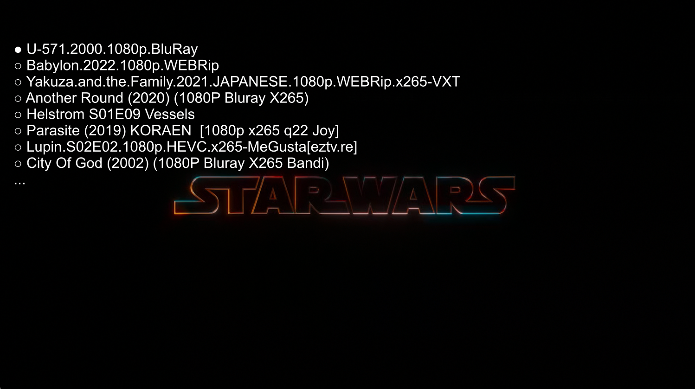

# MPV Watch Later OSD Menu

This is a Lua script for the MPV media player that shows a list of the saved files in the "watch later" directory in an interactive menu sorted from the newest.

Base on awesome script [mpv-playlistmanager](https://github.com/jonniek/mpv-playlistmanager).

## Features

- Dynamic keybindings for navigating the menu (arrow keys, PgUp, PgDn, Home, and End)
- Supports selecting items with Enter or Shift+Enter to start playing the selected file after saving the current position

## Installation

1. Download the script file (`watch_later_osd_menu.lua`)
2. Move the script file to the MPV scripts directory (`~/.config/mpv/scripts/` on Unix or `%APPDATA%\mpv\scripts\` on Windows)
3. Add the following line to your `mpv.conf` file (create one if it doesn't exist):
	`write-filename-in-watch-later-config`
4. If you have already saved positions you need to resave them with previous option set
5. Add the following line to your `input.conf` file (create one if it doesn't exist):
	`Shift+Enter script-binding watch_later_osd_menu/showmenu`
6. Save the file and restart MPV.

## Usage

Press Shift+Enter to show the watch later playlist menu. Navigate through the items using the up and down arrow keys, PgUp, PgDn, Home, and End. Press Enter to play saved item or press Shift+Enter save current postion and then play selected item.

## Configuration

The script supports the following options, which can be set in the `watch_later_osd_menu.lua` file:

- `key_*`: dynamic keybinding
- `header`: Menu header
- other self explanatory settings

## License

This script is released under the Unlicense. See the `LICENSE` file for more details.
